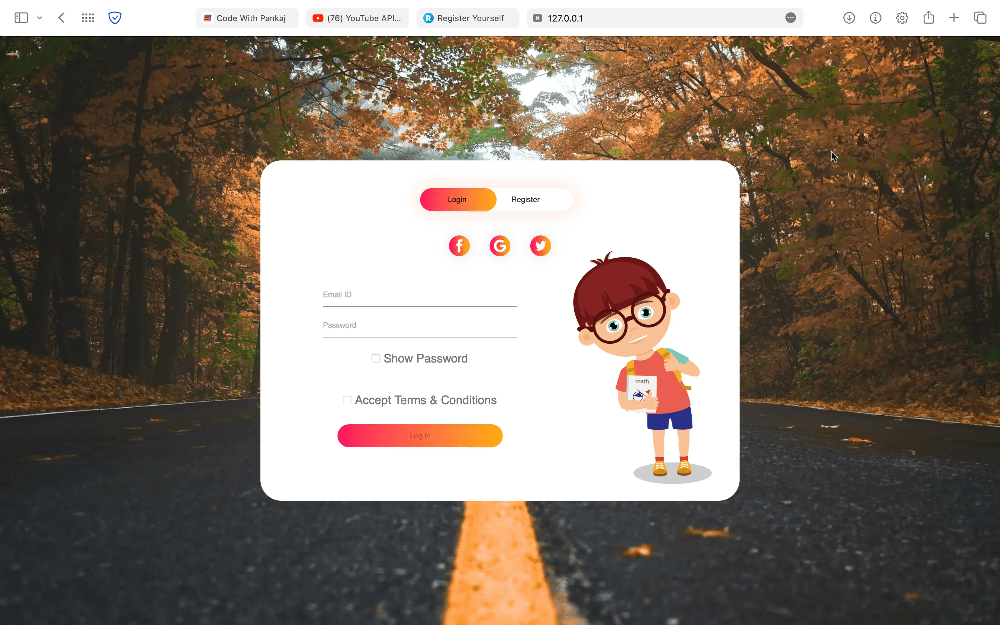

# Login_Signup_Page

This ☝️ repository is related to a ❤️ attractive login/signup page.<br>
You can see the live preview 🖼️ of that page by clicking on below link. 🔗

## Features

 - Add to cart
 - Images Slideshow
 - Related product suggestions


## Authors

- [@pankajkumar90](https://www.github.com/pankajkumar90)


## Contributing

Contributions are always welcome!

See `index.html` for ways to get started.

Please adhere to this project's `code of conduct`.


## Demo

https://login-signup-page1.vercel.app
<br><br>
https://pankajkumar90.github.io/Login_Signup_Page/


## Feedback

If you have any feedback, please reach out to us at pankajbaliyan90@gmail.com


## 🔗 Links
[](https://codewithpankaj.vercel.app)

[](https://www.linkedin.com/in/pankaj-kumar-90/)

## Lessons Learned

I learned many things while making this repository, i.e. how to make a login signup page, which is responsible to all plateforms
## Run Locally

Clone the project

```bash
  git clone https://github.com/Pankajkumar90/Chupa-chups-drink.git
```

Go to the project directory

```bash
  cd my-project
```

Start code editor

```bash
  code .
```


## Screenshots




## Support

For support, email pankajbaliyan90@gmail.com or join our Slack channel.

